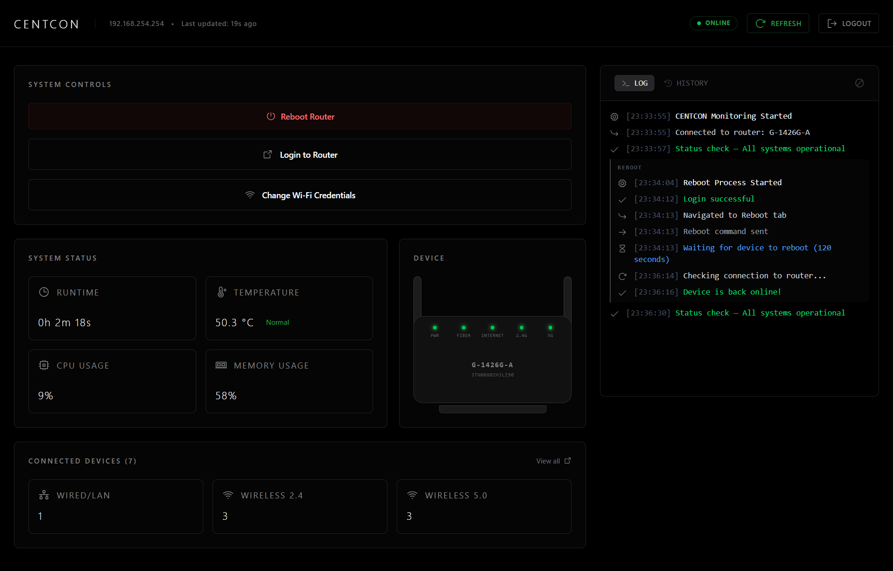

# CENTCON

Real-time router dashboard with Selenium-powered automation for reboots, assisted admin login, and live Wi-Fi credential and broadcast management. Includes a live event log with passive network monitoring, device tracking, grouped operation logs, and persistent event history.

**Stack:** React (Vite) frontend · FastAPI backend · Selenium automation · Server-Sent Events



---

## Compatibility

> ⚠️ **The Selenium automation is built specifically for one router model.** It uses custom navigation logic tailored to that device's admin interface and will not work correctly on other routers without modification.

| Field | Value |
|-------|-------|
| ISP | Globe (Philippines) |
| Device Model | G-1426G-A |
| Software Version | 3TN00802HJLI90 |

If you have a different router model or firmware version, the Selenium automation sequences (reboot, login, and Wi-Fi credential changes) will likely fail or navigate incorrectly. You would need to update the Selenium logic in the backend to match your router's admin interface.

---

## Prerequisites

Before you begin, install the following software:

| Tool | Version | Download | Verify |
|------|---------|----------|--------|
| Node.js | 18+ | https://nodejs.org/ | `node --version` |
| Python | 3.10+ | https://www.python.org/downloads/ | `python --version` |
| Google Chrome | Latest | https://www.google.com/chrome/ | Open `chrome://version` |
| Git | Any | https://git-scm.com/downloads | `git --version` |

> **Windows note:** When installing Python, check **"Add Python to PATH"** on the first screen of the installer.

---

## Installation & Running

### Windows

1. Clone the repository:

```bash
git clone https://github.com/jfontz/centcon
cd centcon
```

2. Double-click `LAUNCH_CENTCON.bat` in the project root.

On first run it will automatically create the Python virtual environment, install all backend and frontend dependencies, then start both servers and open the dashboard. On subsequent runs it skips setup and launches directly.

First launch may take longer while dependencies initialize. Subsequent runs will be much faster.

#### Manual launch on Windows

If you prefer not to use `LAUNCH_CENTCON.bat`:

1. Install frontend dependencies:

```bash
npm install
```

2. Create the virtual environment and install backend dependencies:

```bash
python -m venv .venv
.venv/Scripts/activate
pip install -r backend/requirements.txt
```

3. Run both servers in separate terminals:

```bash
# Terminal 1 — backend (with venv active)
.venv/Scripts/activate
python backend/run.py

# Terminal 2 — frontend
npm run dev
```

Then open `http://localhost:5173`.

### macOS / Linux

1. Clone the repository:

```bash
git clone https://github.com/jfontz/centcon
cd centcon
```

2. Install frontend dependencies:

```bash
npm install
```

3. Create the virtual environment and install backend dependencies:

```bash
python -m venv .venv
source .venv/bin/activate
pip install -r backend/requirements.txt
```

4. Run both servers in separate terminals:

```bash
# Terminal 1 — backend (with venv active)
source .venv/bin/activate
python backend/run.py

# Terminal 2 — frontend
npm run dev
```

Then open `http://localhost:5173`.

---

## First-Run Setup

On the first launch, CENTCON will detect that no configuration exists and open a **setup wizard** automatically. You don't need to manually create or edit any files.

The wizard will ask for:

| Field | What it is |
|-------|------------|
| Router IP Address | The local IP of your router's admin page (default for Globe: `192.168.254.254`) |
| Router Username | Your router's admin username — found on the sticker on your router |
| Router Password | Your router's admin password — same sticker |
| CENTCON PIN | A 4-character PIN *you choose* to protect access to the dashboard |

All values are saved to a `.env` file in the project root. If you ever need to change something after setup — or you forget your PIN — you can open that file directly and edit any value, then restart the app.

---

## Verifying the Setup

Once both servers are running and setup is complete:

1. Open `http://localhost:5173` — you should see the login screen. Enter the `CENTCON_PIN` you set during setup.
2. Open `http://localhost:8000/docs` — you should see the FastAPI interactive API docs.
3. On the dashboard, click **"Reboot Router"** to test the full automation sequence. This will log into your router and trigger a real reboot — only do this if you're okay with a brief network interruption.

---

## Router Visual

The Device section displays a CSS-rendered silhouette of the Globe G-1426G-A with five LED indicators that reflect live router state:

| LED | What it represents |
|-----|--------------------|
| PWR | Power — on when the router is reachable |
| FIBER | Fiber signal — off or pulsing red during LOS |
| INTERNET | WAN connection status |
| 2.4G | 2.4GHz band — green if devices connected, amber if band is up but empty |
| 5G | 5GHz band — same as above |

**LED states by condition:**

| Condition | PWR | FIBER | INTERNET | 2.4G / 5G |
|-----------|-----|-------|----------|-----------|
| All systems online | 🟢 | 🟢 | 🟢 | 🟢 / 🟡 |
| LOS active | 🟢 | 🔴 pulse | ⚫ | ⚫ |
| No WAN (fiber ok) | 🟢 | 🟢 | 🔴 | 🟢 / 🟡 |
| Rebooting | 🟡 pulse | ⚫ | ⚫ | ⚫ |
| Router unreachable | ⚫ | ⚫ | ⚫ | ⚫ |

---

## Event Log

The log panel runs passively in the background and records events as they are detected on each data refresh. It does not require any interaction.

**Monitored events:**

| Event | Description |
|-------|-------------|
| LOS (Loss of Signal) | Fiber signal lost — TX and RX power both read as zero |
| LOS cleared | Fiber signal restored |
| Internet lost | WAN connection dropped while fiber is still up |
| Internet restored | WAN connection re-established |
| Router unreachable | Dashboard cannot reach the router API |
| Router restored | Router API is reachable again |
| Router reachable (LOS active) | Router API is back but fiber signal is still lost — surfaced after a connectivity gap |
| WAN IP changed | External IP address changed since last poll |
| Device connected | A new device appeared on the network between polls |
| High device count | Total connected devices hit an unusual threshold or spiked suddenly |
| High CPU usage | Router CPU exceeded 80% |
| High memory usage | Router memory exceeded 90% |
| High temperature | Optical transceiver temperature exceeded 70°C |

Automation events (reboot, Wi-Fi credential changes) are grouped together in the log under a labeled block so they're easy to scan separately from passive monitoring events.

---

## Event History

The log panel includes a **History** tab that persists significant events across sessions using localStorage. Unlike the live log which resets on page reload, history is retained for up to 60 days, unless cleared.

**Recorded event types:** LOS, internet lost/restored, router unreachable/restored, reboots, and device/health warnings.

**History features:**
- Bar chart showing event severity over time
- 24H, 7D, and 60D time range toggles
- Resolution control (24 or 48 buckets for 24H, 7 or 14 for 7D)
- Click any bar to inspect the timestamped events in that window
- Summary line showing clean percentage and total event count
- Clear history button with confirmation modal

---

## Connected Devices

The Connected Devices section shows a count of devices by interface type (LAN, 2.4GHz, 5GHz). Clicking **View all** opens a modal listing every connected device with its hostname, IP address, and band.

Devices can be marked as **Trusted** or left as **Unknown**. Trusted status is saved locally in the browser and persists across router reboots. It is only lost if a device's IP address changes (e.g. after a DHCP lease expiry that assigns a different IP).

---

## Project Structure

```text
└── 📁centcon
    └── 📁backend
        ├── main.py                        # FastAPI app, routes, command scheduling
        ├── requirements.txt
        ├── run.py                         # Uvicorn entry point
        ├── selenium_login.py              # Opens Chrome, logs into router, leaves session open for manual use
        ├── selenium_reboot.py             # Full reboot automation workflow
        ├── selenium_wifi_credentials.py   # Changes credentials and broadcast toggles in one session
        ├── setup_utils.py                 # First-run setup helpers for validation, auto-detect, and .env writes
        ├── state_manager.py               # SSE state broadcasting and subscriptions
    └── 📁public
        ├── favicon.svg
    └── 📁src
        └── 📁assets
            └── 📁icons
                ├── (SVG icon assets)
                ├── index.js
            └── 📁fonts
                └── 📁geist
                └── 📁geist-mono
        └── 📁components
            └── 📁buttons
                ├── SystemControlButton.jsx
            └── 📁cards
                ├── CPUCard.jsx
                ├── LANCard.jsx
                ├── MemoryCard.jsx
                ├── RuntimeCard.jsx
                ├── TemperatureCard.jsx
                ├── WiFi24Card.jsx
                ├── WiFi5Card.jsx
            └── 📁header
                ├── Header.jsx
                ├── HeaderButton.jsx
                ├── MetaInfo.jsx
                ├── StatusBadge.jsx
            └── 📁log
                ├── HistoryView.jsx            # Persistent event history with bar chart
                ├── LogContent.jsx
                ├── LogEntry.jsx
                ├── LogHeader.jsx              # LOG / HISTORY tab switcher with clear-log control
            └── 📁modals
                ├── ClearHistoryModal.jsx      # Confirmation modal for history clear
                ├── DeviceListModal.jsx
                ├── RebootConfirmModal.jsx
                ├── WifiCredentialModal.jsx
            └── 📁ui
                ├── HelpTooltip.jsx
                ├── IconWrapper.jsx
                ├── InputField.jsx
                ├── MainLayout.jsx
                ├── MetricCard.jsx
                ├── SectionContainer.jsx
            ├── ConnectedDevices.jsx           # Device count by band with expandable device list
            ├── DeviceInformation.jsx          # Wraps RouterVisual
            ├── LogPanel.jsx
            ├── RouterVisual.jsx               # CSS router silhouette with live LED indicators
            ├── SystemControls.jsx             # Reboot, login, and Wi-Fi credential action buttons
            ├── SystemStatus.jsx               # Uptime, temperature, CPU, and memory status cards
        └── 📁context
            ├── AuthContext.jsx                # Session auth context with 8-hour expiry and backend-driven login config
            ├── RouterContext.jsx              # Router telemetry plus command, log, and SSE state context
        └── 📁hooks
            ├── useRouterData.js               # Router API polling, status derivation, and reboot-aware refresh control
        └── 📁pages
            ├── Login.jsx
            ├── Setup.jsx
        └── 📁services
            ├── apiConfig.js                   # Shared backend URL constant
            ├── authAPI.js
            ├── commandApi.js                  # SSE connection, command triggers, and command metadata fetching
            ├── routerDataApi.js               # Router data fetching and parsing
            ├── setupAPI.js
        └── 📁utils
            ├── formatters.js
            ├── getIcon.jsx
            ├── getLedStates.js                # Maps router state to LED configs for RouterVisual
            ├── historyStorage.js              # localStorage history: read, write, prune, bucket
            ├── routerHelpers.js
            ├── validators.js
        ├── App.jsx
        ├── index.css
        ├── main.jsx
    ├── .env.example
    ├── .gitignore
    ├── eslint.config.js
    ├── index.html
    ├── LAUNCH_CENTCON.bat                     # One-click setup and launcher for Windows
    ├── LICENSE
    ├── package-lock.json
    ├── package.json
    ├── README.md
    └── vite.config.js
```

---

## Extending CENTCON

The frontend fetches command metadata from `GET /commands` on mount, so `COMMAND_DEFINITIONS` in `backend/main.py` is the single source of truth for button definitions. No separate frontend config file exists.

Removing a button:
- Delete its entry from `COMMAND_DEFINITIONS` in `backend/main.py`.
- Delete its workflow file from `backend/`.

Adding a button:
- Add a new entry to `COMMAND_DEFINITIONS` in `backend/main.py` with the required fields: `label`, `buttonClass`, `icon`, `confirm`, `dangerous`, `blocksOthers`, `allowWhileBusy`, `disableSelf`, and `workflow`.
- Create a new Selenium workflow file in `backend/` following the same pattern as `selenium_reboot.py` or `selenium_login.py`.

> **Note:** Wi-Fi Credentials is a special case — it opens a modal to collect input before triggering, and uses its own dedicated backend route (`/commands/wifi-credentials`) instead of the standard `COMMAND_DEFINITIONS` flow. If you're modifying it, refer to `selenium_wifi_credentials.py` and the route in `main.py` directly.

---

## Troubleshooting

**`python: command not found`**
Try `python3` instead. On Windows, reinstall Python and ensure "Add to PATH" is checked.

**`pip: command not found`**
Run `python -m pip install --upgrade pip` (or `python3 -m pip ...` on macOS/Linux).

**`Cannot activate virtual environment` (Windows PowerShell)**
Run PowerShell as Administrator and allow script execution:
```powershell
Set-ExecutionPolicy RemoteSigned
```

**`ChromeDriver version mismatch` error**
Delete any manually installed ChromeDriver from your PATH (e.g. `C:\WebDrivers\chromedriver.exe`). Selenium's built-in manager will use the correct version automatically.

**`ChromeDriver error` or `Chrome binary not found`**
Ensure Google Chrome is installed in its default location:
- Windows: `C:\Program Files\Google\Chrome\Application\chrome.exe`
- macOS: `/Applications/Google Chrome.app`
- Linux: `/usr/bin/google-chrome`

**Need to see the Selenium browser window?**
Set `REBOOT_SELENIUM_HEADLESS` or `WIFI_SELENIUM_HEADLESS` to `false` in `.env`, then restart the backend.

**`Module not found` errors**
Make sure `(.venv)` is visible in your terminal prompt, then re-run:
```bash
pip install -r backend/requirements.txt
```

**Setup wizard keeps appearing even after completing setup**
The backend may not have restarted after the `.env` file was written. Stop and restart the backend server.

**Login page asks for a PIN but I forgot it**
Open the `.env` file in the project root — your `CENTCON_PIN` is stored there. You can also change it there and restart the app.

---

*Built by [jfontz](https://github.com/jfontz) · [MIT License](./LICENSE)*
